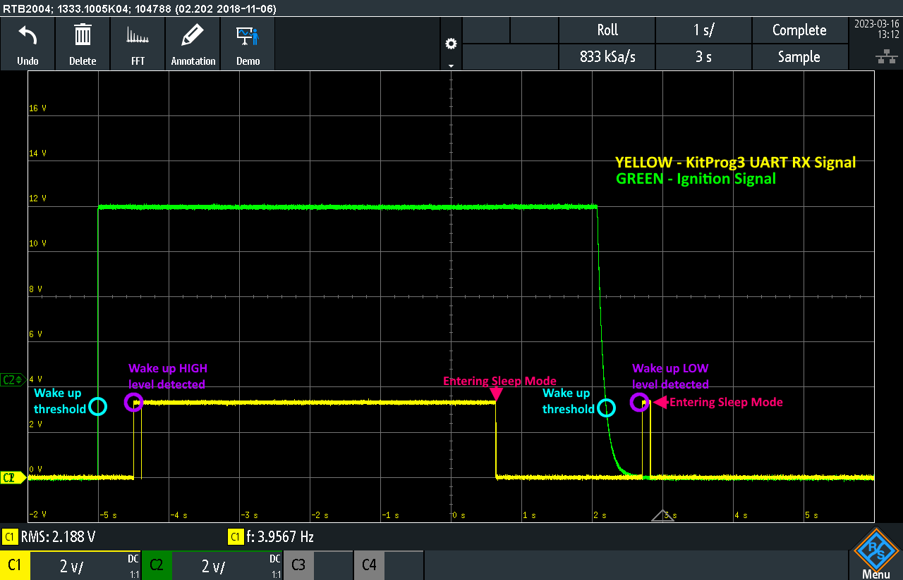
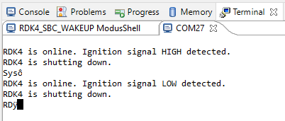
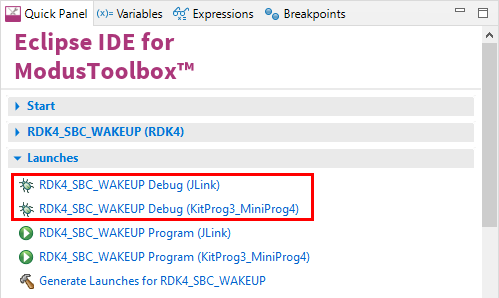

# RDK4 TLE9262-3BQX SBC "Ignition Signal" Wake Up

Rutronik Development Kit 4 Programmable System-on-Chip CY8C4149AZE-S598 "SBC Ignition Signal Wake Up" Code Example. 

 

The wake threshold of the TLE9262-3BQX WK3 input is 3V. Once the voltage threshold is crossed on WK3 pin - the wake up event happens. If a TLE9262-3BQX is woken up with a rising edge of the Ignition signal, the system stays 5 seconds online before entering the Sleep Mode. If TLE9262-3BQX is woken up with a falling edge of the Ignition signal, the system goes into the Sleep Mode just right after the initialization.

## Requirements

- [ModusToolbox™ software](https://www.cypress.com/products/modustoolbox-software-environment) v3.0

## Using the code example

Create the project and open it using one of the following:

<details><summary><b>In Eclipse IDE for ModusToolbox&trade; software</b></summary>


1. Click the **New Application** link in the **Quick Panel** (or, use **File** > **New** > **ModusToolbox&trade; Application**). This launches the [Project Creator](https://www.infineon.com/ModusToolboxProjectCreator) tool.

2. Pick a kit supported by the code example from the list shown in the **Project Creator - Choose Board Support Package (BSP)** dialog.

   When you select a supported kit, the example is reconfigured automatically to work with the kit. To work with a different supported kit later, use the [Library Manager](https://www.infineon.com/ModusToolboxLibraryManager) to choose the BSP for the supported kit. You can use the Library Manager to select or update the BSP and firmware libraries used in this application. To access the Library Manager, click the link from the **Quick Panel**.

   You can also just start the application creation process again and select a different kit.

   If you want to use the application for a kit not listed here, you may need to update the source files. If the kit does not have the required resources, the application may not work.

3. In the **Project Creator - Select Application** dialog, choose the example by enabling the checkbox.

4. (Optional) Change the suggested **New Application Name**.

5. The **Application(s) Root Path** defaults to the Eclipse workspace which is usually the desired location for the application. If you want to store the application in a different location, you can change the *Application(s) Root Path* value. Applications that share libraries should be in the same root path.

6. Click **Create** to complete the application creation process.

For more details, see the [Eclipse IDE for ModusToolbox&trade; software user guide](https://www.infineon.com/MTBEclipseIDEUserGuide) (locally available at *{ModusToolbox&trade; software install directory}/docs_{version}/mt_ide_user_guide.pdf*).

</details>

<details><summary><b>In command-line interface (CLI)</b></summary>


ModusToolbox&trade; software provides the Project Creator as both a GUI tool and the command line tool, "project-creator-cli". The CLI tool can be used to create applications from a CLI terminal or from within batch files or shell scripts. This tool is available in the *{ModusToolbox&trade; software install directory}/tools_{version}/project-creator/* directory.

Use a CLI terminal to invoke the "project-creator-cli" tool. On Windows, use the command line "modus-shell" program provided in the ModusToolbox&trade; software installation instead of a standard Windows command-line application. This shell provides access to all ModusToolbox&trade; software tools. You can access it by typing `modus-shell` in the search box in the Windows menu. In Linux and macOS, you can use any terminal application.

The "project-creator-cli" tool has the following arguments:

| Argument          | Description                                                  | Required/optional |
| ----------------- | ------------------------------------------------------------ | ----------------- |
| `--board-id`      | Defined in the `<id>` field of the [BSP](https://github.com/Infineon?q=bsp-manifest&type=&language=&sort=) manifest | Required          |
| `--app-id`        | Defined in the `<id>` field of the [CE](https://github.com/Infineon?q=ce-manifest&type=&language=&sort=) manifest | Required          |
| `--target-dir`    | Specify the directory in which the application is to be created if you prefer not to use the default current working directory | Optional          |
| `--user-app-name` | Specify the name of the application if you prefer to have a name other than the example's default name | Optional          |

<br />

The following example clones the "[Hello world](https://github.com/Infineon/mtb-example-hal-hello-world)" application with the desired name "MyHelloWorld" configured for the *CY8CPROTO-062-4343W* BSP into the specified working directory, *C:/mtb_projects*:

   ```
   project-creator-cli --board-id CY8CPROTO-062-4343W --app-id mtb-example-hal-hello-world --user-app-name MyHelloWorld --target-dir "C:/mtb_projects"
   ```

**Note:** The project-creator-cli tool uses the `git clone` and `make getlibs` commands to fetch the repository and import the required libraries. For details, see the "Project creator tools" section of the [ModusToolbox&trade; software user guide](https://www.infineon.com/ModusToolboxUserGuide) (locally available at *{ModusToolbox&trade; software install directory}/docs_{version}/mtb_user_guide.pdf*).

To work with a different supported kit later, use the [Library Manager](https://www.infineon.com/ModusToolboxLibraryManager) to choose the BSP for the supported kit. You can invoke the Library Manager GUI tool from the terminal using `make modlibs` command or use the Library Manager CLI tool "library-manager-cli" to change the BSP.

The "library-manager-cli" tool has the following arguments:

| Argument             | Description                                                  | Required/optional |
| -------------------- | ------------------------------------------------------------ | ----------------- |
| `--add-bsp-name`     | Name of the BSP that should be added to the application      | Required          |
| `--set-active-bsp`   | Name of the BSP that should be as active BSP for the application | Required          |
| `--add-bsp-version`  | Specify the version of the BSP that should be added to the application if you do not wish to use the latest from manifest | Optional          |
| `--add-bsp-location` | Specify the location of the BSP (local/shared) if you prefer to add the BSP in a shared path | Optional          |

<br />

Following example adds the CY8CPROTO-062-4343W BSP to the already created application and makes it the active BSP for the app:

   ```
   library-manager-cli --project "C:/mtb_projects/MyHelloWorld" --add-bsp-name CY8CPROTO-062-4343W --add-bsp-version "latest-v4.X" --add-bsp-location "local"

   library-manager-cli --project "C:/mtb_projects/MyHelloWorld" --set-active-bsp APP_CY8CPROTO-062-4343W
   ```

</details>

<details><summary><b>In third-party IDEs</b></summary>


Use one of the following options:

- **Use the standalone [Project Creator](https://www.infineon.com/ModusToolboxProjectCreator) tool:**

  1. Launch Project Creator from the Windows Start menu or from *{ModusToolbox&trade; software install directory}/tools_{version}/project-creator/project-creator.exe*.

  2. In the initial **Choose Board Support Package** screen, select the BSP, and click **Next**.

  3. In the **Select Application** screen, select the appropriate IDE from the **Target IDE** drop-down menu.

  4. Click **Create** and follow the instructions printed in the bottom pane to import or open the exported project in the respective IDE.

<br />

- **Use command-line interface (CLI):**

  1. Follow the instructions from the **In command-line interface (CLI)** section to create the application.

  2. Export the application to a supported IDE using the `make <ide>` command.

  3. Follow the instructions displayed in the terminal to create or import the application as an IDE project.

For a list of supported IDEs and more details, see the "Exporting to IDEs" section of the [ModusToolbox&trade; software user guide](https://www.infineon.com/ModusToolboxUserGuide) (locally available at *{ModusToolbox&trade; software install directory}/docs_{version}/mtb_user_guide.pdf*).

</details>

### Operation

The firmware example uses KitProg3 UART for debugging information output. The RDK4 will print the message to the terminal if HIGH or LOW Ignition [Battery] signal has been detected. The CY8C4149AZE-S598 MCU initializes the TLE9262-3BQXV33 to detect static wake up event and puts it into Sleep Mode. During the wake up event, no matter if it is a Ignition-HIGH or Ignition-LOW signal, the MCU is powered up and prints the information as it is shown below.



The "Ignition Input" is the input "WK3 pin-24" of the TLE9262-3BQXV33 System Basis Chip. The WK3 pin has no internal pull-up or pull-down configuration, since it has an external 10K pull-down resistor R12 connected so the pin is not left "floating". Nevertheless it has a 64μs filter enabled to avoid the false-trigger of the pin due to the electromagnetic interferences that might be present in harsh working environment. The configuration of the wake up pin WK3 resides in the "TLE926x_SPI.h" file.

```
#define CW_WK_CTRL_1 (0x0) /*decimal 0*/

#define CW_WK_CTRL_2 (0x4) /*decimal 4*/

#define CW_WK_FLT_CTRL (0x10) /*decimal 16*/

#define CW_WK_PUPD_CTRL (0x0) /*decimal 0*/
```

### Debugging

If you successfully have imported the example, the debug configurations are already prepared to use with a the KitProg3, MiniProg4, or J-link. Open the ModusToolbox™ perspective and find the Quick Panel. Click on the desired debug launch configuration and wait for the programming to complete and the debugging process to start.



## Legal Disclaimer

The evaluation board including the software is for testing purposes only and, because it has limited functions and limited resilience, is not suitable for permanent use under real conditions. If the evaluation board is nevertheless used under real conditions, this is done at one’s responsibility; any liability of Rutronik is insofar excluded. 


